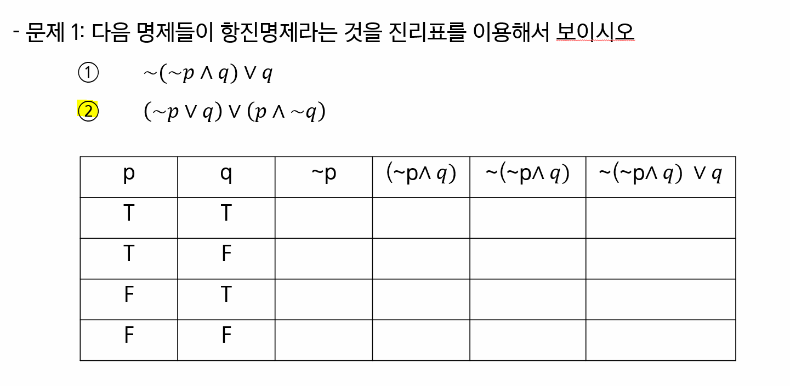
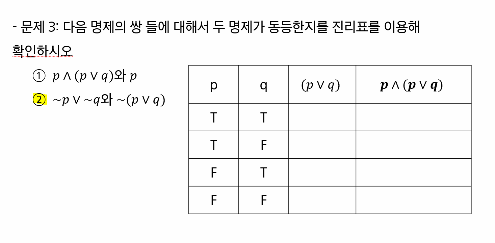
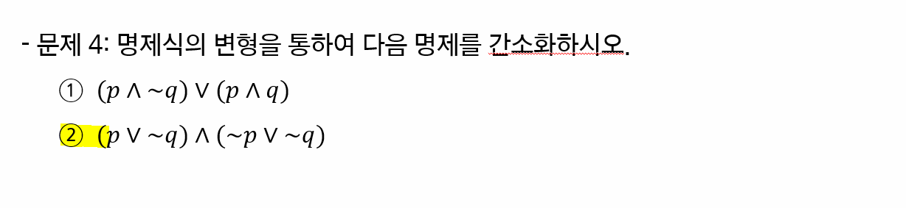

# 논리와 증명

> 함께 학습하고 고민하고 설명하며 작은 부분 하나라도 '내 것'으로 만들어보세요. 😁

### **이 과정은 왜 배우냐면요..1️⃣**

1. 컴퓨터공학에서 어떤 주제로 학습 하는지 경험해 볼 수 있습니다.
   - 하루만에 이 모든 지식을 다 내것으로 만들 수는 없지만 추후 학습의 작은 트리거가 될 수 있습니다. 
2. 문제를 풀 때 단순하게 느낌에 의존하는 것이 아닌 명확한 근거를 기반으로 사고하는 것이 어떤 것인지 체험해 볼 수 있습니다.
3. 개발자가 되기 위해 필요한 제반 지식을 얻을 수 있습니다.

### **아래의 규칙을 지켜주세요.. 2️⃣**

1. 학습한 내용을 수기 작성, 테블릿 등을 활용하여 작성해 주시고 결과를 이미지로 첨부해주세요.
   
   - 물론 마크다운 등을 활용하여 결과를 작성해도 됩니다.

2. 모르는 내용이 나오면 팀원과 함께 자료를 찾아가면 공부해보세요.
   
   - '학습' 그 자체에 초점을 맞춰서 공부해보세요. 생각보다 많은 것을 얻어갈 수 있을거에요.
   
   - 조 별로 궁금한 내용을 서로 물어보고 찾아가며 함께 만들어가요.

3. 아래와 같은 순서로 학습하시는 것을 추천합니다.
   
   1. 교재를 기반으로 1차 학습
      
      - 한 문제 한 문제 같이 풀어보며 정답 작성하기
      
      - 중간에 풀리지 않는 문제 등은 빠르게 넘어가기
   
   2. 모든 문제를 다 풀고 풀리지 않는 문제로 돌아와서 2차 학습
      
      - 교재로 해결되지 않는 부분은 구글링을 통해 해결
      - 다른 조와의 협업을 통해서도 해결 가능

4. 최종 풀이 완료 이후 **조 별 하나의 공동 문서를 작성하며 정리**

### 모든 문제를 푸셨다면..3️⃣

1. 조 별 완성본 파일이 담긴 1개의 폴더 준비
   
   - 조장이 `1_논리와_증명.md` 파일 최상단에 조장 & 조원 명단 작성

2. 조장이 오늘 날짜(`0928`) 폴더 만들어서 PR 보내기
   
   - 조장만 진행
   
   - 조 별 완성본은 1개만 제출
   
   - PR 폴더 구조
     
     ```
     ...
     0321/
         ...
     0322/
         ...
     0323/
         1조/ # 폴더
             1_논리와_증명.md
             2_수와 표현.md 
             ...
         2조/
             1_논리와_증명.md
             2_수와 표현.md 
             ...
         3조/
             1_논리와_증명.md
             2_수와 표현.md 
             ...
         ...
     ```

### **참고 사이트는요.. 4️⃣**

https://www.desmos.com/calculator?lang=ko

https://www.wolframalpha.com/

## 1-2 번

                              

## 

    p   q   ~p   (~p ^ q)    ~(~p^q)    ~(~p^q)vq
    
    T   T    F      F            T        T
    T   F    F      T            F        T
    F   T    T      T            F        T
    F   F    T      F            T        T


## 2-2 번


```
p    q    ~q     (p ^ q)      (p^~q)     (p^q)^(p^~q)

T    T    F         T            F            F      
T    F    T         F            T            F    
F    T    F         F            T            F   
F    F    T         T            F            F
```


## 3-2 번



```
p    q      (p v q)     p^(pvq)

T    T         T            T    
T    F         T            T     
F    T         T            F    
F    F         F            T   
```


## 4-2 번



```
~q v (p ^ ~p)
p^~p = 0
~q v (p ^ ~p) = ~q
```


## 5-2 번 & 5-4번


**5-2번**

```
Z는 정수이므로 항상 X^2 >= X
```


**5-4번**

```
정수는 음수일때, 양수일때, 0일때로 나눌 수 있으나 어떤 경우에도 X^2<X 가 되는 경우는 없음. 거짓
```


# 7번


```
N이 홀수 => N = 2X+1
N^2+N = (2X+1)^2+2X+1

4X^2+4X+1+2X+1 = 4X^2+6X+2
4X^2+6X+2 = 2(2X^2+3X+1)
-> 2로 나누어 떨어지므로 짝
```


## 9번

    

```
N = 홀수 = (2X+1)
N^2+5 = (2X+1)^2+5
= 4X^2+4X+1+5 = 4X^2+4X+6
= 2(2X^2+2X+3)
-> N이 홀수일때 N^2+5 는 짝수이므로 N^2 +5가 홀 수 일때 n은 짝
```


## 10번


```
N^2 = 2X
N = (2X)^(1/2)


```


## 11번


## 12번


